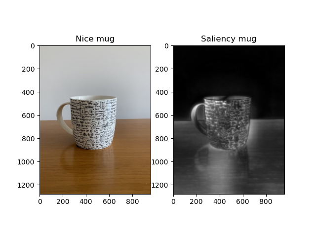

# ICOM-saliency-detection

ICOM model for saliency estimation is a project that I developed for my bachelor graduation.
It takes inspiration from Itti et Al. model presented in:

``Itti, Laurent & Koch, Christof & Niebur, Ernst. (1998). A Model of Saliency-based Visual Attention for Rapid Scene Analysis. Pattern Analysis and Machine Intelligence, IEEE Transactions on. 20. 1254 - 1259. 10.1109/34.730558.``

My contribution is the addition of a component for motion detection, which enables ICOM model to estimate spatiotemporal saliency.
The motion-detection algorithm derives from an implementation of Diamond Search fast block-matching motion estimation algorithm, presented in:

``Shan Zhu and Kai-Kuang Ma, "A new diamond search algorithm for fast block-matching motion estimation," in IEEE Transactions on Image Processing, vol. 9, no. 2, pp. 287-290, Feb. 2000, doi: 10.1109/83.821744.``
___
## About ICOM

To learn more about the topic of visual saliency, ITTI model, ICOM model etc. I uploaded also my thesis in this repo.

`On Saccade and Human Attention - A model of bottom-up saliency for human saccade simulation`

___
## Usage

There are three ways to use ICOM model:
1. estimation of spatial saliency, see `spatial_try.py`
1. estimation of spatiotemporal saliency, see `spatiotemporal_try.py`
1. estimation of spatiotemporal saliency, but with a parallelized implementation, see `parallelized_spatiotemporal_try.py`

___
# Example

This is to give you an idea of what output to expect for a static image:

